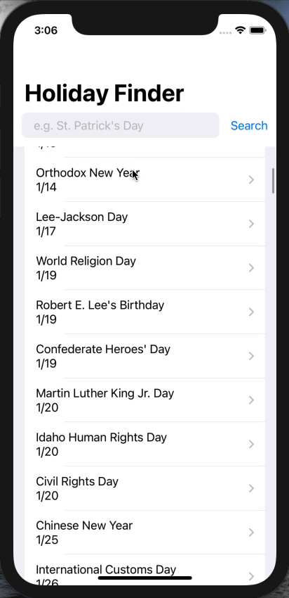

# Holiday Finder

HolidayFinder is an iOS app built with SwiftUI that renders a list of nationally recognized holidays in a user's country. It uses the [Calendarific API](https://calendarific.com/) to pull holiday data, including name, date, description, location information, and more.

Users can search through the list for a given holiday, and can click on one for more information. For holidays that are specific to a given state, HolidayFinder renders a MapView using `MapKit` centered over the state.

## What I Learned

My primary takeaway from this tutorial/hack was learning how to process data and manage state in a Swift project. I learned how to handle asynchronous requests as well as how to process local JSON files.

I also learned how to use SwiftUI, and was able to relate a lot of it to my experience with React and React Native. I also was able to get a bit more experience with the MVC framework.

Overall, I really valued this exercise because I wanted to learn more about native iOS development in XCode with Swift. I think it was helpful to gain exposure outside of JavaScript and see how to natively create a project.

## What Didn't Work

I struggled for a bit getting used to SwiftUI and exactly how to use it. I really liked that I could programmatically render things, but it operates a bit differently than React/React Native, so finding/getting used to conditional rendering and lifecycle functions took a bit.

I also struggled sometimes learning how some of the native iOS components work. Some, like `Text` or `VStack` are straightforward, whereas others like `NavigationView` are more complex.

## Tutorials I Followed

- [https://www.youtube.com/watch?v=tdxKIPpPDAI&ab_channel=BrianAdvent](https://www.youtube.com/watch?v=tdxKIPpPDAI&ab_channel=BrianAdvent)
- [https://www.youtube.com/watch?v=Xetrbmnszjc&ab_channel=BrianAdvent](https://www.youtube.com/watch?v=Xetrbmnszjc&ab_channel=BrianAdvent)
- [https://developer.apple.com/tutorials/swiftui/creating-and-combining-views](https://developer.apple.com/tutorials/swiftui/creating-and-combining-views)

I worked alone on this (without a partner).
